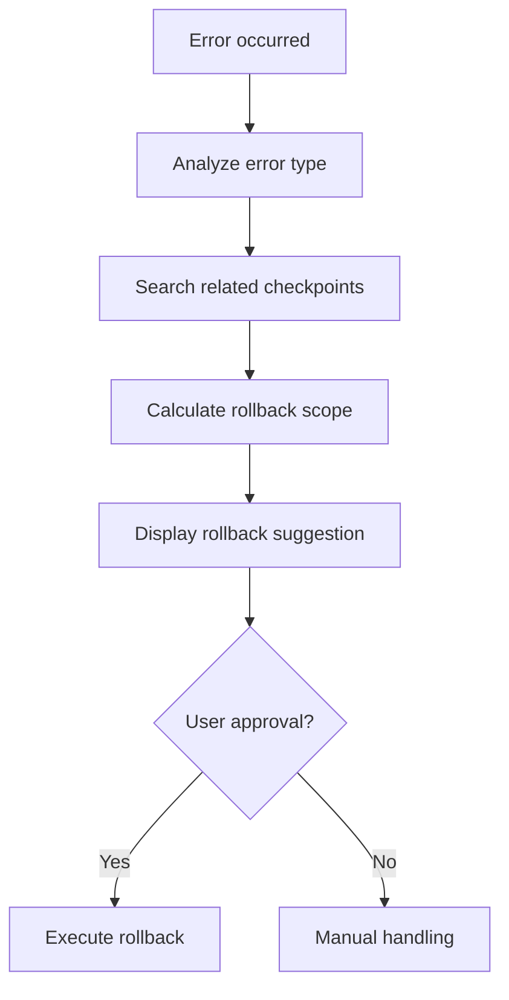

# Auto-Checkpoint - Rollback Guide

## Smart Rollback System

### Auto Analysis on Error



### Rollback Strategy by Error Type

| Error Type | Recommended Scope | Auto Suggestion |
|------------|------------------|-----------------|
| Build failure | File level | ✅ |
| Test failure | Function level | ✅ |
| Runtime error | File level | ✅ |
| Config error | Config files only | ✅ |
| Severe error | Stage level | Confirmation required |

## Rollback Scopes

### 1. File Level Rollback
```bash
# Restore specific file from checkpoint
/restore --checkpoint "auto_task_5" --files "src/auth/UserService.ts"
```

**Suitable Situations**:
- Error due to single file change
- Rolling back specific module

### 2. Function Level Rollback
```bash
# Restore specific function (Supported: TS, JS, Python)
/restore --checkpoint "auto_task_5" --function "UserService.login"
```

**Suitable Situations**:
- Specific function issue during refactoring
- Partial logic error

### 3. Stage Level Rollback
```bash
# Restore entire stage state
/restore --checkpoint "stage_06_start"
```

**Suitable Situations**:
- Widespread issues
- Canceling architecture-level changes

### 4. Config Files Only Rollback
```bash
/restore --checkpoint "auto_change" --config-only
```

**Suitable Situations**:
- Error due to config changes
- Environment configuration issues

## Rollback Preview

```markdown
## Rollback Preview

**Target Checkpoint**: auto_task_5_20240120
**Rollback Scope**: File level

### Files to Restore (3)
| File | Current Size | Restore Size | Change |
|------|--------------|--------------|--------|
| src/auth/UserService.ts | 250 lines | 180 lines | -70 lines |
| src/types/auth.ts | 50 lines | 45 lines | -5 lines |
| tests/auth.test.ts | 100 lines | 80 lines | -20 lines |

### Changes to be Lost
- Password hash function added (UserService.ts:45-80)
- New type definitions (auth.ts:40-50)
- Related tests (auth.test.ts:70-100)

### Affected Dependencies
- LoginForm component (import check required)

**Execute this rollback? (y/n)**
```

## Rollback Execution Process

### Pre-work
1. Create backup checkpoint of current state
2. Stash uncommitted changes

### Rollback Steps
1. Validate checkpoint
2. Extract files
3. Restore selected files
4. Verify integrity
5. Update state files

### Post-work
1. Run verification tests
2. Update HANDOFF
3. Save rollback history

## Auto-Generated Recovery Guide

```markdown
## File Rollback Complete

**Checkpoint**: auto_task_5_20240120
**Files Restored**: 3
**Time**: 2024-01-20 14:45:00

### Recovered Files
- src/auth/UserService.ts
- src/types/auth.ts
- tests/auth.test.ts

### Recommended Next Steps
1. Check changes: `git diff`
2. Run tests: `npm test`
3. If issue resolved:
   - Analyze cause and re-implement
   - Work in smaller units
4. If issue persists:
   - Additional rollback may be needed
   - Run `/restore --suggest`
```

## Safety Measures

### Rollback Block Conditions
- Uncommitted changes exist
- Active processes running
- Files locked

### Confirmation Required Conditions
- Stage level rollback
- 10+ files affected
- Production-related files included

### Cooldown
- 5 minute wait between consecutive rollbacks
- Warning on rolling back same checkpoint again
