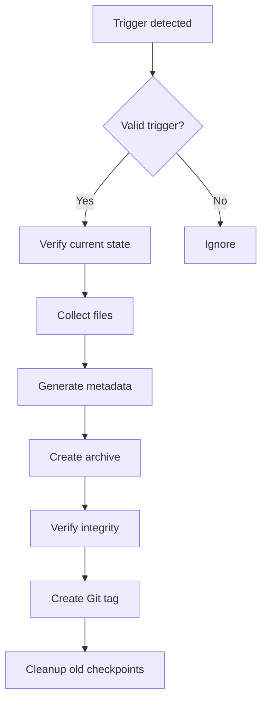

# Auto-Checkpoint - Trigger Guide

## Checkpoint Trigger Conditions

### 1. Task Completion Based
```yaml
trigger:
  condition: "tasks_completed"
  threshold: 5
  action: "create_checkpoint"
```

**Detection Method**:
- Count `completed` status from TodoWrite
- Analyze commit history

### 2. File Change Based
```yaml
trigger:
  condition: "major_file_change"
  threshold: 100  # lines
  weights:
    "*.ts": 1.0
    "*.yaml": 0.5
    "*.md": 0.3
```

**Detection Method**:
```bash
# Calculate change amount
git diff --stat | awk '{sum+=$4} END {print sum}'
```

### 3. Before Destructive Action
```yaml
trigger:
  condition: "destructive_action"
  patterns:
    - "rm -rf"
    - "git reset --hard"
    - "drop table"
```

**Action on Detection**:
1. Create checkpoint immediately
2. Request user confirmation
3. Proceed with action after confirmation

### 4. Time Based
```yaml
trigger:
  condition: "interval"
  interval_minutes: 30
  only_if_changes: true
```

### 5. Stage Based
```yaml
trigger:
  conditions:
    on_stage_complete: true
    on_stage_error: true
```

## Checkpoint Creation Process



## Metadata Format

```yaml
checkpoint:
  name: "auto_task_5_20240120_143022"
  timestamp: "2024-01-20T14:30:22Z"
  trigger: "tasks_completed"
  stage: "06-implementation"
  task_count: 25
  files_changed: 12
  git_commit: "abc1234"

  summary:
    completed_tasks: 5
    modified_files:
      - "src/auth/UserService.ts"
      - "src/components/LoginForm.tsx"
    key_changes: "User authentication system implementation"
```

## Retention Policy

```yaml
retention:
  max_checkpoints: 20
  max_age_days: 30

  # Never delete
  milestones:
    - stage_complete
    - pre_destructive
    - user_created
```

## Naming Conventions

| Trigger | Format | Example |
|---------|--------|---------|
| Task | `auto_task_{count}_{timestamp}` | `auto_task_5_20240120` |
| File change | `auto_change_{timestamp}` | `auto_change_20240120_143022` |
| Destructive | `pre_destructive_{timestamp}` | `pre_destructive_20240120_143022` |
| Stage | `stage_{id}_{status}_{timestamp}` | `stage_06_complete_20240120` |
| Manual | `manual_{name}_{timestamp}` | `manual_feature_complete_20240120` |
