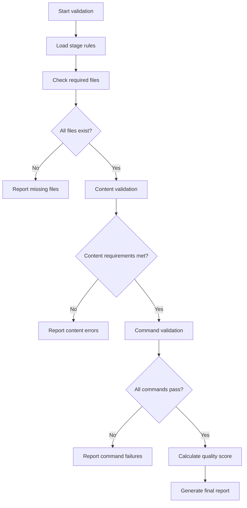

# Output Validator - Validation Process

## Validation Process



## Step-by-Step Validation

### 1. Required File Check

```yaml
# Validation rule example
required_outputs:
  ideas.md:
    exists: true
    min_size_bytes: 500

  "source_code/":
    exists: true
    is_directory: true
```

**Validation Results**:
```markdown
## File Existence Check
✅ ideas.md (1,234 bytes)
✅ source_code/ (directory)
❌ requirements_analysis.md (missing)
```

### 2. Content Validation

```yaml
content_checks:
  min_ideas: 5
  sections:
    - "Functional Requirements"
    - "Non-functional Requirements"
  has_priorities: true
```

**Validation Method**:
- Markdown parsing for section check
- Pattern matching for required elements
- Counting for minimum requirements

**Validation Results**:
```markdown
## Content Validation
✅ ideas.md: 8 ideas (minimum 5)
⚠️ requirements_analysis.md: "Non-functional Requirements" section missing
✅ project_plan.md: All required sections included
```

### 3. Command Validation

```yaml
validation_commands:
  - name: "lint"
    command: "npm run lint"
    required: true
    allow_warnings: true

  - name: "typecheck"
    command: "npm run typecheck"
    required: true

  - name: "test"
    command: "npm run test"
    required: true
```

**Execution and Results**:
```markdown
## Command Validation
✅ lint: Passed (2 warnings)
✅ typecheck: Passed
❌ test: Failed (3 tests failed)
   - tests/auth.test.ts: loginUser should return token
   - tests/auth.test.ts: logout should clear session
   - tests/user.test.ts: createUser validation
```

### 4. Quality Score Calculation

```yaml
quality_metrics:
  lint_score:
    weight: 0.3
    target: 0.9
  test_coverage:
    weight: 0.4
    target: 0.8
  type_coverage:
    weight: 0.3
    target: 0.95
```

**Calculation Results**:
```markdown
## Quality Score
| Metric | Current | Target | Score |
|--------|---------|--------|-------|
| Lint | 0.95 | 0.90 | ✅ 1.0 |
| Coverage | 0.75 | 0.80 | ⚠️ 0.94 |
| Types | 0.98 | 0.95 | ✅ 1.0 |

**Overall Score**: 0.97 (weighted average)
**Status**: Pass (minimum 0.7)
```

## Final Report Format

```markdown
# Output Validation Report

## Stage: 06-implementation
## Validation Time: 2024-01-20 14:30:00

## Summary
- **Status**: ⚠️ Partial Pass
- **Overall Score**: 0.85
- **Passed Items**: 8/10
- **Failed Items**: 2

## Detailed Results

### ✅ Passed Items
1. Required files exist
2. Lint check
3. Type check
...

### ❌ Failed Items
1. Test failures (3)
2. Coverage below target (75% < 80%)

## Required Fixes
1. [ ] Fix tests/auth.test.ts
2. [ ] Increase test coverage by 5%

## Recommended Actions
- Review and fix failed test cases
- Add missing tests
```

## Failure Behavior

### Stage Transition Block
```yaml
on_failure:
  action: "block_transition"
  allow_override: true
  require_justification: true
```

### Override Prompt
```markdown
⚠️ Stage transition blocked due to validation failure.

**Failures**:
- Test failures: 3
- Coverage below target: 75%

Force proceed anyway?
(Enter reason, or 'cancel' to abort)
> _
```
