# User Flows: Mini-Game Heaven

> Generated: 2026-01-22
> Stage: 04-ui-ux
> AI Model: Claude (Structured Analysis)

---

## Overview

| Flow | Priority | User Type |
|------|----------|-----------|
| First-Time User Onboarding | HIGH | New |
| Play Game & Submit Score | HIGH | All |
| Nemesis Notification Loop | HIGH | Returning |
| View Leaderboard | MEDIUM | All |
| Authentication Flow | MEDIUM | New/Returning |
| Push Notification Opt-in | MEDIUM | Authenticated |

---

## 1. First-Time User Onboarding

**Goal**: Get user playing within 30 seconds
**Entry**: App launch (first visit)

### Flow Diagram

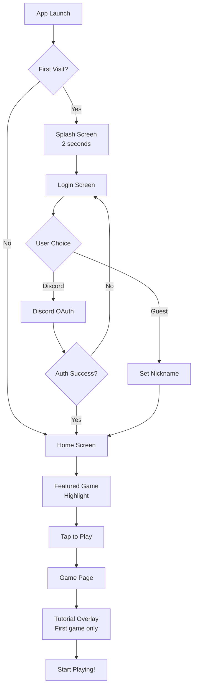

### Step-by-Step

| Step | Screen | Action | Duration |
|------|--------|--------|----------|
| 1 | Splash | Auto-advance | 2s |
| 2 | Login | Tap "Guest" or "Discord" | User action |
| 3 | Home | View featured game | - |
| 4 | Home | Tap game card | User action |
| 5 | Game | See tutorial overlay | 3s |
| 6 | Game | Start playing | - |

### Key Metrics
- **Time to first game**: < 30 seconds (guest)
- **Conversion to Discord login**: Track percentage

---

## 2. Play Game & Submit Score (Core Loop)

**Goal**: Engaging gameplay loop with score persistence
**Entry**: Home screen → Game selection

### Flow Diagram

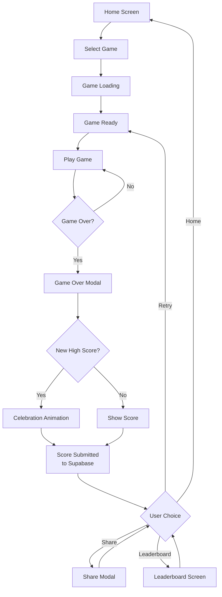

### States & Transitions

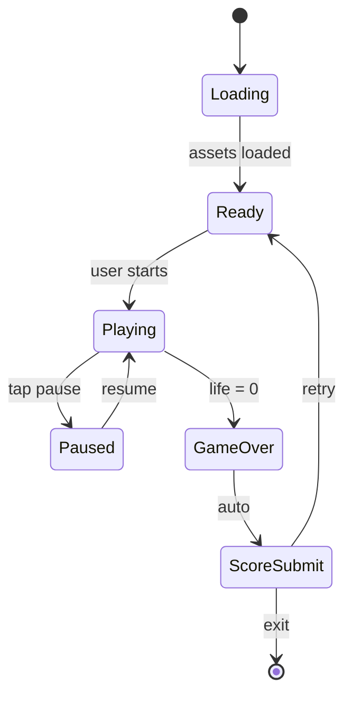

### Error Handling

| Error | User Message | Recovery |
|-------|--------------|----------|
| Score submit failed | "점수 저장 실패. 재시도..." | Auto-retry 3x, then queue for later |
| Game crash | "오류 발생. 다시 시도해주세요" | Return to home, log error |
| Network offline | "오프라인 모드. 점수는 나중에 저장됩니다" | Store locally, sync when online |

---

## 3. Nemesis Notification Loop (Retention Hook)

**Goal**: Re-engage users through competitive push notifications
**Entry**: Another user beats your score

### Flow Diagram

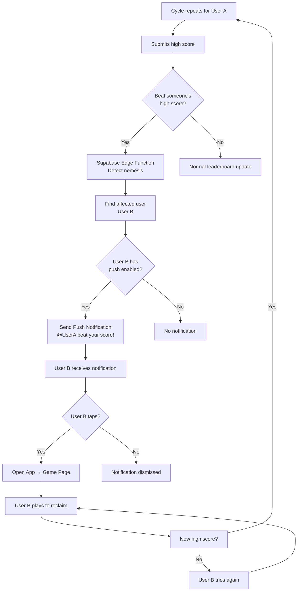

### Push Notification Content

| Scenario | Title | Body |
|----------|-------|------|
| Score beaten | "⚔️ 네메시스 알림" | "@{username}이(가) NEON TOWER에서 당신의 기록을 깼습니다! 15,200점" |
| Reclaimed | "🏆 복수 성공!" | "당신이 NEON TOWER 1위를 되찾았습니다!" |
| Close call | "😰 위기!" | "@{username}이(가) 당신의 기록에 100점 차이로 접근 중!" |

### Notification Rules

- Max 3 notifications per user per day
- Min 1 hour between notifications for same game
- Only notify if user was previously in top 10

---

## 4. Authentication Flow

**Goal**: Seamless Discord OAuth with guest fallback
**Entry**: Login screen or profile upgrade prompt

### Flow Diagram

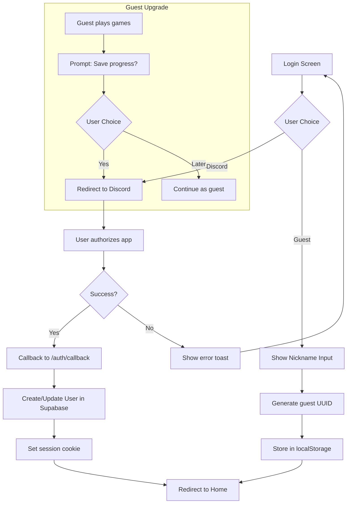

### Session States

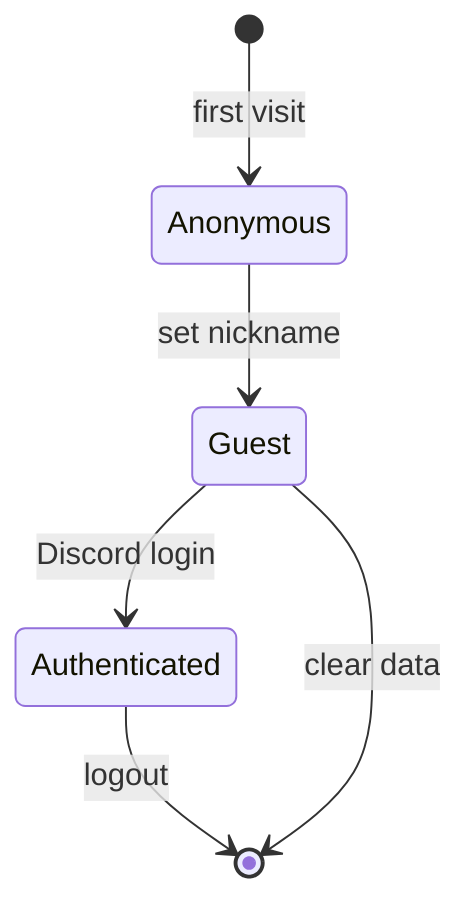

### Data Migration (Guest → Authenticated)

| Data Type | Migration Action |
|-----------|------------------|
| High scores | Merge with existing Discord user |
| Preferences | Transfer to user profile |
| Guest UUID | Archive, not deleted |

---

## 5. View Leaderboard Flow

**Goal**: Quick access to rankings with filtering
**Entry**: Bottom nav or game over modal

### Flow Diagram

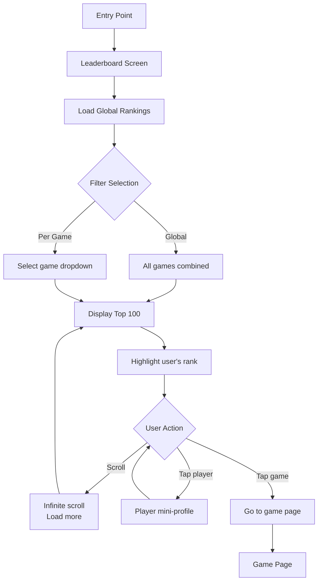

### Realtime Updates

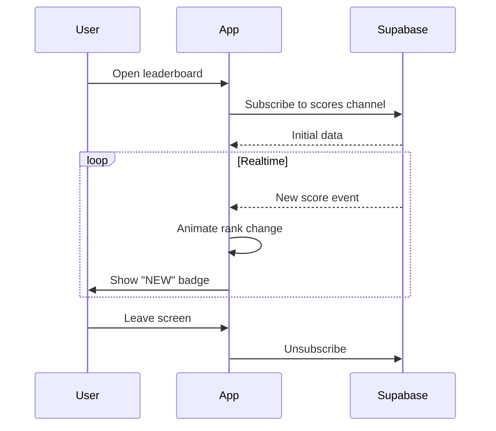

---

## 6. Push Notification Opt-in Flow

**Goal**: Maximize push notification opt-in rate
**Timing**: After first successful game (score > 0)

### Flow Diagram

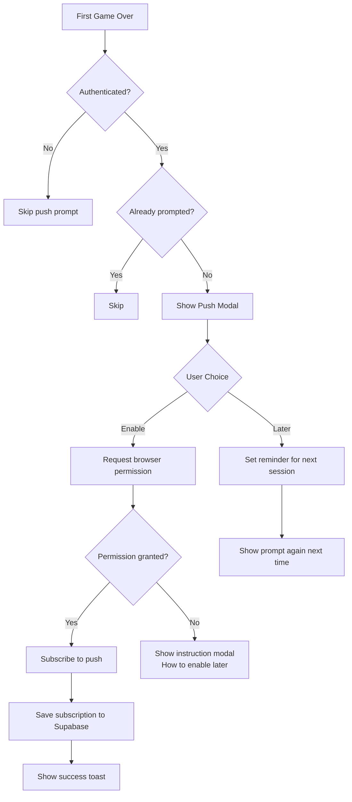

### Permission Request UI

| State | UI Element | Action |
|-------|------------|--------|
| Pre-prompt | Custom modal | Explain value proposition |
| Browser prompt | Native dialog | Wait for response |
| Success | Toast | "알림이 활성화되었습니다!" |
| Denied | Modal | Instructions to enable in browser settings |

---

## 7. Error States & Edge Cases

### Network Error Flow

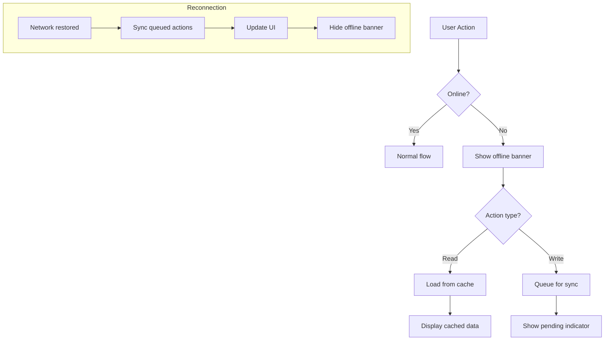

### Session Expiry Flow

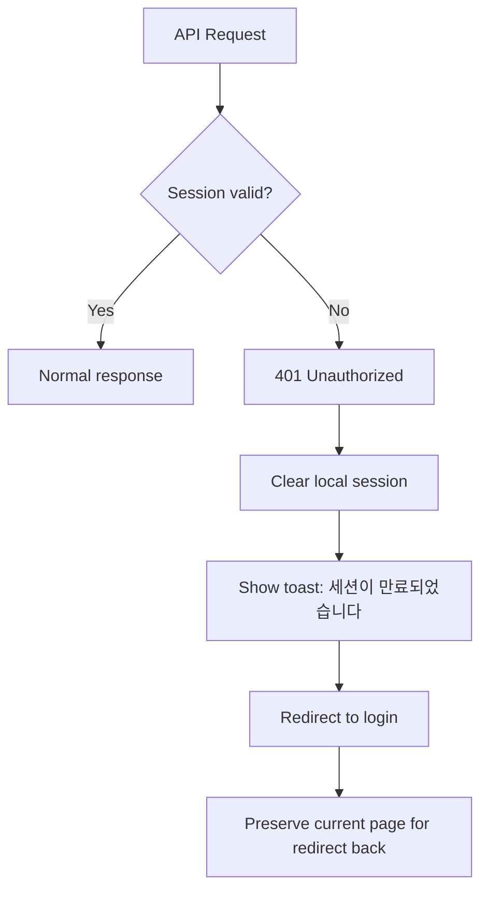

---

## 8. User Journey Map

### New User (First Day)

```
Timeline: 0 ────────────────────────────────────────────────── 10 min

Actions:  [Land] → [Login] → [Browse] → [Play] → [Score] → [Share] → [Close]
              ↓                   ↓         ↓         ↓
Screens:  Splash   Home     Game Page  Game Over  Share Modal
              ↓                   ↓         ↓
Emotions: Curious  Excited   Engaged    Proud/Frustrated
              ↓                   ↓         ↓
Metrics:  Bounce   Time to   Session    Score     Viral
          Rate     1st game  Duration   Submitted Coefficient
```

### Returning User (Day 2+)

```
Timeline: 0 ────────────────────────────────────────────────── 5 min

Actions:  [Push] → [Open] → [Play] → [Beat Score] → [Close]
              ↓       ↓         ↓          ↓
Screens:  Notif   Game    Game Page   Victory
              ↓       ↓         ↓          ↓
Emotions: Competitive  Determined  Triumphant
              ↓       ↓         ↓          ↓
Metrics:  Click    DAU     Retention  Engagement
          Rate
```

---

## 9. Success Metrics by Flow

| Flow | Primary Metric | Target |
|------|----------------|--------|
| Onboarding | Time to first game | < 30s |
| Play & Score | Games per session | > 3 |
| Nemesis Loop | Push notification CTR | > 15% |
| Authentication | Guest → Auth conversion | > 20% |
| Leaderboard | Views per user/day | > 2 |
| Push Opt-in | Opt-in rate | > 40% |

---

*End of User Flows Document*
