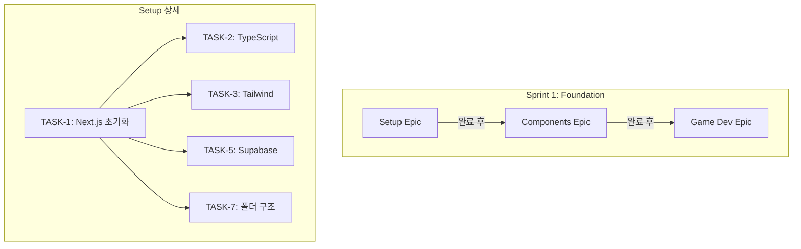

# Stage Handoff: 05-task-management → 06-implementation

**생성일**: 2026-01-22T06:30:00.000Z
**생성자**: ClaudeCode
**소요 시간**: ~1.5h

---

## 완료된 작업

- [x] 태스크 분해 (총 42개)
- [x] 의존성 맵핑 (Blocked By relation 필드)
- [x] 스프린트 계획 (3개)
- [x] 마일스톤 정의 (3개)
- [x] Notion 데이터베이스 구축
- [x] Task ID 시스템 구현 (auto_increment)
- [x] HANDOFF.md 생성

---

## 다음 에이전트를 위한 컨텍스트

### Notion Task Board

**URL**: https://www.notion.so/582253a2a88043f3addc781510bcc9b2

**Schema**:
| Field | Type | Purpose |
|-------|------|---------|
| Task | title | 태스크 이름 |
| Task ID | auto_increment | 고유 식별자 (TASK-1, TASK-2, ...) |
| Status | select | To Do, In Progress, Done, Blocked |
| Priority | select | Must, Should, Could |
| Sprint | select | Sprint 1, Sprint 2, Sprint 3 |
| Epic | select | Setup, Components, Game Dev, Backend, PWA, Polish |
| Estimate | select | 1h, 2h, 3h, 4h, 8h, 1d |
| Stage | select | 06-implementation ~ 10-deployment |
| Blocked By | relation | 의존 태스크 참조 |

### Sprint 1 태스크 (즉시 시작)

| Task ID | 태스크 | 우선순위 | Epic | 의존성 |
|---------|--------|----------|------|--------|
| TASK-1 | Next.js 14 프로젝트 초기화 | Must | Setup | - |
| TASK-2 | TypeScript 설정 (strict mode) | Must | Setup | TASK-1 |
| TASK-3 | Tailwind CSS + 디자인 토큰 설정 | Must | Setup | TASK-1 |
| TASK-4 | ESLint + Prettier + Husky 설정 | Must | Setup | TASK-3 |
| TASK-5 | Supabase 프로젝트 생성 및 연결 | Must | Setup | TASK-1 |
| TASK-6 | 데이터베이스 스키마 생성 (SQL) | Must | Setup | TASK-5 |
| TASK-7 | 폴더 구조 설정 (architecture.md 기반) | Must | Setup | TASK-1 |

### 의존성 요약



### 마일스톤

| 마일스톤 | 목표 | 완료 기준 | Git Tag |
|----------|------|-----------|---------|
| M1 | 첫 번째 게임 플레이 가능 | Neon Tower Stack 완성, 핵심 UI 구현 | v0.1.0 |
| M2 | 모든 게임 + 인증 | 3개 게임, Discord OAuth, Leaderboard | v0.2.0 |
| M3 | Production 배포 | Push 알림, Lighthouse 90+, Vercel | v1.0.0 |

### 기술적 주의사항

1. **Phaser 3 SSR 이슈**: `next/dynamic`으로 클라이언트 전용 로드 필수
   ```typescript
   const PhaserGame = dynamic(() => import('@/components/PhaserGame'), {
     ssr: false
   });
   ```

2. **Supabase Realtime**: 필요한 테이블만 구독하여 비용 최적화

3. **디자인 토큰**: `stages/04-ui-ux/outputs/design_system.md` 참조
   - Primary: `#00D9FF` (Neon Cyan)
   - Spacing: 4px 기반

4. **폴더 구조**: `stages/03-planning/outputs/architecture.md` 참조
   ```
   src/
   ├── app/           # Next.js App Router
   ├── components/    # UI 컴포넌트
   ├── games/         # Phaser 게임 로직
   ├── stores/        # Zustand 스토어
   └── lib/           # 유틸리티
   ```

---

## 생성된 산출물

| 파일 | 설명 |
|------|------|
| `outputs/sprint_plan.md` | 스프린트 계획 (3개 스프린트, 42개 태스크) |
| `outputs/milestones.md` | 마일스톤 정의 (M1, M2, M3) |
| `outputs/task_management_guide.md` | Notion 태스크 관리 가이드 |

---

## 06-implementation 스테이지 가이드

### 즉시 실행할 작업

1. **Next.js 14 프로젝트 생성**
   ```bash
   npx create-next-app@latest mini-game-heaven --typescript --tailwind --app --src-dir
   ```

2. **필수 의존성 설치**
   ```bash
   npm install phaser zustand @supabase/supabase-js
   npm install -D @types/node eslint-config-prettier husky lint-staged
   ```

3. **폴더 구조 설정** (architecture.md 기반)

### 구현 순서 권장

1. **Setup Epic 완료** (TASK-1 ~ TASK-7)
   - 순차적 진행, 의존성 준수
   - 각 태스크 완료 시 Notion Status → Done

2. **Components Epic** (TASK-8 ~ TASK-17)
   - Button, Header, BottomNav 먼저
   - 그 후 GameCard, Modal, Toast
   - 마지막으로 페이지 컴포넌트

3. **Game Dev Epic** (TASK-18 ~ TASK-22)
   - Phaser 통합 설정 필수 선행
   - GameLoader → Neon Tower Stack

### 체크포인트 트리거

- Sprint 1 완료 시 (Milestone M1)
- 핵심 기능 구현 완료 시
- 위험한 리팩토링 전

### 커밋 규칙

```
feat(impl): TASK-{id} - {description}
```

예시:
```
feat(impl): TASK-1 - initialize Next.js 14 project with TypeScript
feat(impl): TASK-8 - implement Button component with variants
```

---

## AI 호출 기록

| AI | 호출 시간 | 프롬프트 | 결과 | 상태 |
|----|----------|---------|------|------|
| ClaudeCode | 05:00 | Notion 데이터베이스 생성 | 42개 태스크 생성 | Success |
| ClaudeCode | 05:45 | Task ID 필드 추가 | auto_increment 설정 | Success |
| ClaudeCode | 06:00 | Blocked By 관계 필드 추가 | relation 필드 생성 | Success |
| ClaudeCode | 06:15 | 문서 생성 | sprint_plan, milestones, guide | Success |

> 설정: `config/ai_logging.yaml`

---

## 참조 문서

### 이전 스테이지 산출물

| Stage | File | Purpose |
|-------|------|---------|
| 03-planning | `outputs/architecture.md` | 시스템 아키텍처 |
| 03-planning | `outputs/tech_stack.md` | 기술 스택 결정 |
| 03-planning | `outputs/implementation.yaml` | 구현 규칙 |
| 04-ui-ux | `outputs/design_system.md` | 디자인 토큰 |
| 04-ui-ux | `outputs/wireframes.md` | 와이어프레임 |
| 04-ui-ux | `outputs/user_flows.md` | 사용자 흐름 |

### 설정 파일

| File | Purpose |
|------|---------|
| `config/implementation.yaml.template` | 구현 규칙 템플릿 |
| `templates/task_schema.yaml` | 태스크 스키마 |

---

## 메타데이터

```yaml
stage: "05-task-management"
status: "completed"
next_stage: "06-implementation"
models_used:
  - claudecode
total_tasks: 42
total_sprints: 3
total_milestones: 3
notion_database: "https://www.notion.so/582253a2a88043f3addc781510bcc9b2"
```

---

## Quick Start for 06-implementation

```bash
# 1. 프로젝트 디렉토리로 이동
cd /Users/youjungmin/Documents/vibespace/mini-game-heaven

# 2. Next.js 프로젝트 생성 (mini-game-heaven 폴더 내)
npx create-next-app@latest . --typescript --tailwind --app --src-dir --import-alias "@/*"

# 3. 필수 의존성 설치
npm install phaser zustand @supabase/supabase-js @supabase/auth-helpers-nextjs
npm install -D husky lint-staged @typescript-eslint/eslint-plugin

# 4. Husky 초기화
npx husky init

# 5. 개발 서버 시작
npm run dev
```

---

*End of Handoff Document*
