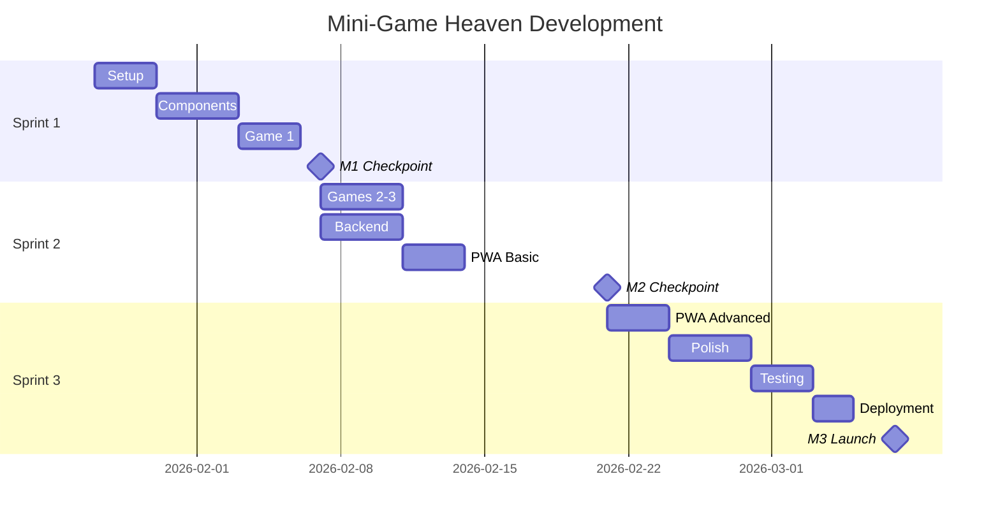

# Milestones: Mini-Game Heaven

> Generated: 2026-01-22
> Stage: 05-task-management

---

## Overview

| Milestone | Target | Sprint | Key Deliverable |
|-----------|--------|--------|-----------------|
| M1 | Week 2 | Sprint 1 | Playable Game 1 |
| M2 | Week 4 | Sprint 2 | All Games + Auth |
| M3 | Week 6 | Sprint 3 | Production Launch |

---

## Milestone 1: Foundation Complete

**Target**: Sprint 1 완료 (Week 2 End)

### Goals
- Next.js 14 프로젝트 설정 완료
- 핵심 UI 컴포넌트 구현
- 첫 번째 게임 (Neon Tower Stack) 플레이 가능

### Deliverables

| Category | Deliverable | Validation |
|----------|-------------|------------|
| Setup | 프로젝트 초기화 | `npm run dev` 성공 |
| Setup | TypeScript strict mode | 타입 에러 없음 |
| Setup | Tailwind + 디자인 토큰 | 스타일 적용 확인 |
| Setup | ESLint + Prettier | `npm run lint` 통과 |
| Setup | Supabase 연결 | Connection test 성공 |
| Setup | DB 스키마 | 테이블 생성 확인 |
| Components | Button, Header, BottomNav | 렌더링 확인 |
| Components | GameCard, Modal, Toast | 상호작용 동작 |
| Components | Layout, Home, Game 페이지 | 라우팅 동작 |
| Components | Zustand 스토어 | 상태 관리 동작 |
| Game | Phaser 3 통합 | Dynamic import 성공 |
| Game | Neon Tower Stack | 게임 플레이 가능 |

### Success Criteria

```yaml
criteria:
  - name: "Dev Server Running"
    check: "npm run dev가 에러 없이 실행"
  - name: "Type Safety"
    check: "npm run typecheck 통과"
  - name: "Lint Clean"
    check: "npm run lint 통과"
  - name: "Game Playable"
    check: "Neon Tower Stack 게임 시작부터 종료까지 플레이 가능"
  - name: "Mobile Responsive"
    check: "320px ~ 768px 뷰포트에서 정상 렌더링"
```

### Checkpoint

```
checkpoint/
  └── m1-foundation-complete/
      ├── timestamp: 2026-02-XX
      ├── git_tag: v0.1.0
      └── snapshot: full project state
```

---

## Milestone 2: Full Game Suite

**Target**: Sprint 2 완료 (Week 4 End)

### Goals
- 모든 게임 (3종) 완성
- Discord OAuth 인증 동작
- 리더보드 실시간 업데이트

### Deliverables

| Category | Deliverable | Validation |
|----------|-------------|------------|
| Game | Gravity Switcher | 게임 플레이 가능 |
| Game | Color Rush | 게임 플레이 가능 |
| Backend | Discord OAuth | 로그인/로그아웃 동작 |
| Backend | Guest 모드 | localStorage UUID 생성 |
| Backend | 점수 API | Edge Function 응답 확인 |
| Components | Login 페이지 | OAuth 플로우 동작 |
| Components | Leaderboard | Realtime 구독 동작 |
| Components | Profile 페이지 | 통계 표시 |
| PWA | manifest.json | 설치 프롬프트 표시 |
| PWA | Service Worker | 캐싱 동작 |
| PWA | IndexedDB | 오프라인 점수 저장 |

### Success Criteria

```yaml
criteria:
  - name: "All Games Playable"
    check: "3개 게임 모두 시작-플레이-종료 가능"
  - name: "Authentication"
    check: "Discord 로그인 성공 및 사용자 정보 표시"
  - name: "Leaderboard"
    check: "점수 제출 후 실시간 리더보드 업데이트"
  - name: "PWA Installable"
    check: "Chrome DevTools Application > Manifest 유효"
  - name: "Offline Support"
    check: "오프라인에서 게임 플레이 가능"
```

### Checkpoint

```
checkpoint/
  └── m2-full-game-suite/
      ├── timestamp: 2026-02-XX
      ├── git_tag: v0.2.0
      └── snapshot: full project state
```

---

## Milestone 3: Production Ready

**Target**: Sprint 3 완료 (Week 6 End)

### Goals
- Push 알림 동작 (Nemesis System)
- Lighthouse 90+ 점수
- Vercel Production 배포

### Deliverables

| Category | Deliverable | Validation |
|----------|-------------|------------|
| PWA | Web Push 구독 | VAPID 키 생성 및 구독 동작 |
| Components | Push 권한 UI | 권한 요청 다이얼로그 |
| Backend | Nemesis 감지 | Edge Function 동작 |
| Backend | Push 발송 | 알림 수신 확인 |
| Backend | 딜링크 처리 | 알림 클릭 시 해당 게임으로 이동 |
| Polish | 애니메이션 | 부드러운 전환 효과 |
| Polish | Lighthouse 90+ | Performance, A11y, SEO 통과 |
| Polish | 번들 최적화 | First Load JS < 100KB |
| QA | 에러 바운더리 | 크래시 방지 및 복구 |
| Testing | E2E 테스트 | 핵심 플로우 테스트 통과 |
| Testing | 단위 테스트 | Coverage 80%+ |
| Deploy | Vercel 배포 | Production URL 동작 |
| Deploy | 환경변수 | 모든 secrets 설정 완료 |

### Success Criteria

```yaml
criteria:
  - name: "Push Notifications"
    check: "점수 기록 경신 시 Nemesis에게 Push 알림 전송"
  - name: "Lighthouse Score"
    check: "Performance 90+, Accessibility 90+, SEO 90+"
  - name: "E2E Tests"
    check: "Playwright 테스트 100% 통과"
  - name: "Production Deploy"
    check: "vercel.app 도메인에서 정상 동작"
  - name: "Zero Console Errors"
    check: "콘솔에 에러 메시지 없음"
```

### Checkpoint

```
checkpoint/
  └── m3-production-ready/
      ├── timestamp: 2026-02-XX
      ├── git_tag: v1.0.0
      └── snapshot: full project state
```

---

## Milestone Timeline



---

## Risk Assessment

### Milestone 1 Risks

| Risk | Impact | Probability | Mitigation |
|------|--------|-------------|------------|
| Phaser SSR 이슈 | High | Medium | Dynamic import 철저히 적용 |
| Tailwind 설정 복잡 | Medium | Low | 공식 문서 참조, 점진적 설정 |

### Milestone 2 Risks

| Risk | Impact | Probability | Mitigation |
|------|--------|-------------|------------|
| Discord OAuth 설정 | Medium | Medium | Supabase 공식 가이드 따르기 |
| Realtime 비용 | Low | Low | 필요한 테이블만 구독 |
| IndexedDB 호환성 | Medium | Low | Dexie.js 라이브러리 사용 |

### Milestone 3 Risks

| Risk | Impact | Probability | Mitigation |
|------|--------|-------------|------------|
| Push 알림 권한 거부 | Medium | High | 적절한 타이밍에 요청, UX 최적화 |
| Lighthouse 점수 미달 | Medium | Medium | 초기부터 성능 고려, 번들 분석 |
| E2E 테스트 불안정 | Medium | Medium | 안정적인 selector 사용 |

---

## Validation Checklist

### Pre-Milestone Review

- [ ] 모든 Must 태스크 완료
- [ ] Should 태스크 80% 이상 완료
- [ ] 블로킹 이슈 해결
- [ ] 코드 리뷰 완료
- [ ] 테스트 통과

### Post-Milestone Actions

- [ ] Git 태그 생성 (v0.1.0, v0.2.0, v1.0.0)
- [ ] 체크포인트 생성
- [ ] HANDOFF.md 업데이트
- [ ] Retrospective 진행
- [ ] 다음 스프린트 계획 확인

---

## Stage Mapping

| Milestone | Primary Stage | Secondary Stages |
|-----------|---------------|------------------|
| M1 | 06-implementation | - |
| M2 | 06-implementation | - |
| M3 | 07-refactoring, 08-qa, 09-testing, 10-deployment | - |

---

## Summary

| Metric | M1 | M2 | M3 |
|--------|----|----|----|----|
| Tasks | 22 | 14 | 16 |
| Duration | 2 weeks | 2 weeks | 2 weeks |
| Key Feature | First Game | All Games + Auth | Production |
| Git Tag | v0.1.0 | v0.2.0 | v1.0.0 |

---

*End of Milestones Document*
