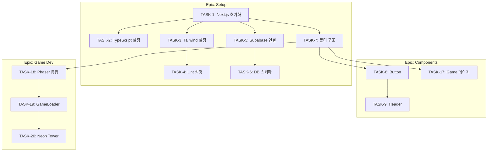

# Task Management Guide: Mini-Game Heaven

> Generated: 2026-01-22
> Stage: 05-task-management

---

## Overview

이 가이드는 Mini-Game Heaven 프로젝트의 Notion 기반 태스크 관리 시스템 사용법을 설명합니다.

---

## Notion Database

**URL**: https://www.notion.so/582253a2a88043f3addc781510bcc9b2

### Database Schema

| Field | Type | Description | Options |
|-------|------|-------------|---------|
| Task | title | 태스크 이름 | - |
| Task ID | auto_increment | 고유 식별자 (TASK-1, TASK-2, ...) | Auto-generated |
| Status | select | 현재 상태 | To Do, In Progress, Done, Blocked |
| Priority | select | 우선순위 | Must, Should, Could |
| Sprint | select | 스프린트 할당 | Sprint 1, Sprint 2, Sprint 3 |
| Epic | select | Epic 분류 | Setup, Components, Game Dev, Backend, PWA, Polish |
| Estimate | select | 예상 소요 시간 | 1h, 2h, 3h, 4h, 8h, 1d |
| Stage | select | 실행 스테이지 | 06-implementation ~ 10-deployment |
| Blocked By | relation | 의존 태스크 (self-reference) | 다른 태스크 참조 |

---

## Task ID System

### Idempotent Operations

Task ID는 태스크의 **고유 식별자**로, 다음과 같은 목적으로 사용됩니다:

1. **멱등성 보장**: 동일한 태스크가 중복 생성되는 것을 방지
2. **의존성 추적**: `Blocked By` 필드에서 참조
3. **진행 상황 추적**: 스프린트 간 태스크 추적

### Task ID Format

```
TASK-{number}
```

- `TASK-1`: 첫 번째 태스크
- `TASK-42`: 42번째 태스크

### Task ID 활용 예시

```markdown
## 태스크 참조 시
- TASK-1 (Next.js 14 프로젝트 초기화)에 의존
- TASK-8 ~ TASK-17 (Components)이 TASK-1 ~ TASK-7 (Setup)에 의존

## 의존성 설정 시
TASK-18 (Phaser 3 통합)은 TASK-7 (폴더 구조 설정)에 의존
→ Blocked By 필드에 TASK-7 페이지 연결
```

---

## Dependency Management

### Blocked By 필드 사용법

1. **의존하는 태스크 열기**
2. `Blocked By` 필드 클릭
3. **선행 태스크 검색 및 선택**

### 핵심 의존 관계



### 의존성 규칙

| 규칙 | 설명 |
|------|------|
| Setup → Components | 모든 컴포넌트는 Setup 완료 후 시작 |
| Setup → Game Dev | Phaser 통합은 폴더 구조 설정 후 |
| Components → Backend | 인증 UI는 기본 컴포넌트 완료 후 |
| Backend → PWA | Push 알림은 Backend 완료 후 |

---

## Workflow

### 태스크 상태 전환

```
To Do → In Progress → Done
           ↓
        Blocked
```

### 상태별 의미

| Status | 의미 | 다음 액션 |
|--------|------|-----------|
| **To Do** | 시작 대기 | 의존성 확인 후 시작 |
| **In Progress** | 작업 중 | 완료 또는 블로킹 이슈 해결 |
| **Done** | 완료 | 다음 태스크 시작 |
| **Blocked** | 차단됨 | 블로킹 태스크 완료 대기 |

### Sprint 진행

1. **Sprint 1** (Week 1-2): Setup + Components + Game 1
2. **Sprint 2** (Week 3-4): Games 2-3 + Backend + PWA 기본
3. **Sprint 3** (Week 5-6): PWA + Polish + Deployment

---

## Best Practices

### 1. 태스크 시작 전

- [ ] 의존 태스크(Blocked By) 확인
- [ ] 모든 의존 태스크가 `Done` 상태인지 확인
- [ ] 필요한 입력 파일/정보 확보

### 2. 태스크 진행 중

- [ ] Status를 `In Progress`로 변경
- [ ] 이슈 발생 시 즉시 Status를 `Blocked`로 변경
- [ ] 블로킹 원인을 코멘트로 기록

### 3. 태스크 완료 시

- [ ] 완료 기준 충족 확인
- [ ] Status를 `Done`으로 변경
- [ ] 관련 커밋 생성 (Conventional Commits)

### 4. 커밋 메시지 규칙

```
feat(impl): TASK-{id} - {태스크 설명}
fix(qa): TASK-{id} - {버그 수정 설명}
refactor(refactor): TASK-{id} - {리팩토링 설명}
```

---

## Views Recommended

### 1. Board View (칸반)

- **그룹화**: Status
- **용도**: 전체 진행 상황 한눈에 파악

### 2. Sprint View

- **그룹화**: Sprint
- **필터**: Status != Done
- **용도**: 스프린트별 남은 작업 확인

### 3. Timeline View

- **용도**: 일정 시각화
- **필터**: Sprint별 또는 Epic별

### 4. Dependency View

- **정렬**: Task ID 순
- **표시 필드**: Task, Blocked By, Status
- **용도**: 의존성 추적

---

## Automation Tips

### Notion Formula (권장)

```
// 의존성 완료 여부 체크 (Formula 필드 추가 시)
if(empty(prop("Blocked By")), "Ready", "Waiting")
```

### Integration

- **GitHub Projects**: Notion API로 양방향 동기화 가능
- **Slack**: Notion Integration으로 상태 변경 알림

---

## Troubleshooting

### Q: 의존 태스크가 완료되었는데 블로킹으로 표시됨
**A**: `Blocked By` 필드에서 완료된 태스크를 제거하거나, Status를 수동으로 변경

### Q: Task ID가 순서대로 생성되지 않음
**A**: Notion auto_increment는 생성 순서 기반. 삭제된 ID는 재사용되지 않음

### Q: 스프린트 변경이 필요한 경우
**A**: Sprint 필드 값 변경 + 의존성 재검토

---

## Summary

| 항목 | 값 |
|------|-----|
| 총 태스크 | 42개 |
| Sprint | 3개 |
| Epic | 6개 |
| 의존성 추적 | Blocked By (relation) |
| 고유 식별자 | Task ID (auto_increment) |

---

*End of Task Management Guide*
